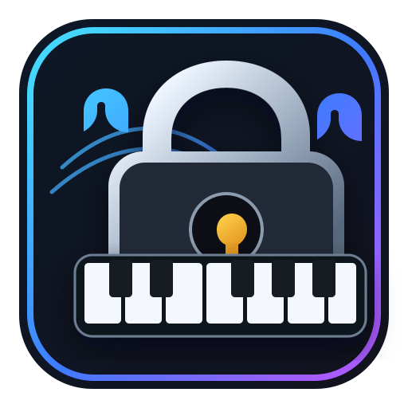

<div align="center">



# PitchPassKey

**Music-inspired deterministic password generation for desktop**

Capture a sequence of notes from a MIDI controller and derive a reproducible password locally, without storing the password itself.

[](https://github.com/brucerc94/PitchPassKey/actions/workflows/ci.yml)
[](https://www.python.org/)
[](https://doc.qt.io/qtforpython/)

</div>

## Overview

PitchPassKey is a local desktop application that turns an ordered sequence of musical notes into a deterministic password.

The idea is simple:

`MIDI notes → canonical sequence → HMAC-SHA-256 derivation → password`

The application keeps the workflow intentionally small. There is no account database, no password vault UI, and no requirement to remember a different phrase for each service.

## What it does

- Captures note events from a connected MIDI controller.
- Uses the note number and the order in which notes were played.
- Ignores velocity, timing, duration, sustain, and other performance data.
- Derives a deterministic password from the captured sequence.
- Uses a per-profile 32-byte secret stored through the operating system credential store.
- Keeps the generated password masked by default.
- Lets the user copy the generated password to the system clipboard.
- Uses a modular architecture so future input sources, including audio-to-note transcription, can be integrated without changing the password domain.
- Runs locally as a desktop application with a PySide6 / Qt 6 interface.

## Why it is different

PitchPassKey is built around a memorable musical interaction rather than a conventional password generator.

The same sequence on the same profile produces the same password. A copied sequence alone does not reproduce that password on another machine or profile because the derivation also depends on the profile secret stored by the operating system.

This makes PitchPassKey useful as a deterministic credential-generation experiment, while keeping the core interaction intentionally simple.

## Security model

The musical sequence is **not** treated as a cryptographic key by itself.

At first use, PitchPassKey creates a random 32-byte profile secret and stores it through the operating system's credential/keyring mechanism. Password derivation then combines that secret with the canonical note sequence and derives output using HMAC-SHA-256.

Important limitations:

- A predictable or publicly known melody should not be treated as a high-entropy secret.
- The current application is not a replacement for a professionally audited password manager.
- For high-value accounts, use a password manager and multi-factor authentication.
- Clipboard contents are controlled by the operating system and may remain available until replaced or cleared.

PitchPassKey is intended to be local-first and transparent about these trade-offs.

## User interface

The desktop UI is deliberately minimal:

1. **Input** — select a MIDI device and capture notes.
2. **Sequence** — review the captured notes in order.
3. **Password** — choose the length and generate the result.

The generated password is hidden by default.

## Architecture

PitchPassKey follows Clean Architecture and keeps framework-specific concerns at the edges.

```text
src/pitchpasskey/
├── domain/
│   ├── models.py
│   ├── policies.py
│   └── ports.py
│
├── application/
│   ├── capture_sequence.py
│   └── password_service.py
│
├── infrastructure/
│   ├── audio/
│   ├── crypto/
│   ├── midi/
│   └── secrets/
│
└── presentation/
    └── ui.py
```

The important dependency direction is:

```text
Presentation
     ↓
Application
     ↓
Domain ← Ports ← Infrastructure
```

The domain does not import Qt, MIDI libraries, audio libraries, or OS-specific storage APIs.

## Current technology

- Python 3.10+
- PySide6 / Qt 6
- mido
- python-rtmidi
- keyring
- HMAC-SHA-256
- pytest

## Installation

### Windows

The easiest way to run PitchPassKey is:

```text
run.bat
```

On the first launch, the launcher creates `.venv` and installs the project dependencies.

After that, it reuses the environment and skips the installation step unless a dependency is missing.

To force a repair/reinstall:

```bat
run.bat --repair
```

### Manual setup

```bash
python -m venv .venv
```

Windows:

```bat
.venv\\Scripts\\activate
python -m pip install -e .
python -m pitchpasskey
```

Linux/macOS:

```bash
source .venv/bin/activate
python -m pip install -e .
python -m pitchpasskey
```

## Development

Install development dependencies:

```bash
python -m pip install -e ".[dev]"
```

Run tests:

```bash
python -m pytest
```

## Future integration

The project already exposes a stable note-input boundary for future sources.

An external audio transcription system can eventually provide:

```text
Audio → NoteInputSource → NoteEvent → NoteSequence
```

The password domain and application layer do not need to know whether those notes came from a MIDI controller or an audio transcription engine.

## Roadmap

The project is intentionally starting small. Possible future work includes:

- Audio-to-note input integration.
- More robust hardware/device handling.
- Application packaging for end users.
- Automated UI testing.
- Secure clipboard lifecycle handling.
- Optional portable profile/key management.
- Broader platform testing.

## Project status

PitchPassKey is an early-stage project under active development. The current focus is establishing a clean foundation before expanding the feature set.

## License

No open-source license has been selected yet. A license should be added before publishing the repository as a reusable open-source project.
